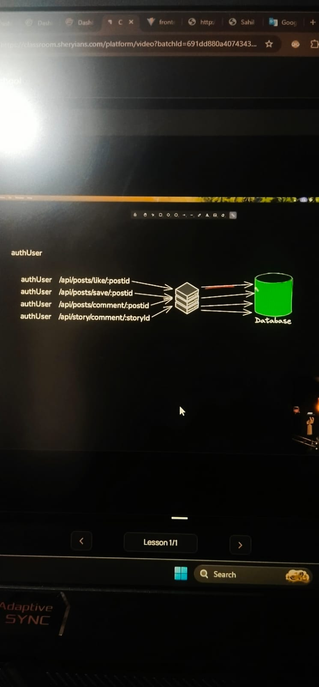

Kisi bhi developer ke paas puri knowledge nhi hoti..
Ye industry bss aapse 2 cheze demand krti hai
   - Scalable Thinking process like future challenges etc
   - Delivery of work

   https://codepen.io/mediapipe-preview/pen/OJBVQJm

# Development me ek concept aata hai "Blackbox Programming"
  iska mtlb hota hai aapka pta hai cheez kaam kya kr rhi hai, but aapko exactly nhi pata wo kaam kaise kr rhi hai ye nhi pata.
  Aur sach btau ye aapko janne ki jrurt bhi nhi hai.

  hme bss code ko optimize krte waqt doc pdna pd jata hai.

## Hmare paas ek library hai "TensorFlow"  [https://www.tensorflow.org/]
  - An end-to-end platform for machine learning
  - Iski help se hmm prne projects me ML ka use kr skte hai.
  - Explore this website.
  - Waise toh Machine learning Python ke through krte hai but inn library se thodi bohot JS ke sath bhi kr skte hai.

  - Inn sb library ka use krke tum litrally Subway surfer Hand gesture se khel skte ho bina screen touch kiye.

## Token Blacklisting:

 -User jb server pr regster krta hai tb server user ko ek token deta hai as a response.
 -in future ab jo bhi req user bhejega tb token bhi sath jayega, and iss token se server pehchanega ki user kon hai.
 - Jb user logout krne ki req bhejega server ko tb server uske cookie me jo token hai use delete kr degaa. { hmne pehle pada tha user cookie ke data ko write, delete, update sb kr skta hai., inn short server ke paas full access hota hai cookie ka.}
 - toh ab ye btao sirf token delete krne se valid logout hua? isme boohot si problem ho skti hai.
 - Maan lo User A ka jo token tha usko User B ne chura liya and ab jb User A logout hai, now User B can access all the data of User A with the help of User A's token.
 - ISLIYE HME TOKEN KO BLACKLIST KRNA PDTA HAI, jb user Logout krta hai.
 - ise krne ke liye hm server side pr ek blacklist maintain kr rhe honge..
 - jb user logout krega toh abhi bhi hm cookie se clear kreneg token ko and uss token ko blacklist me add kr denge.
 - ab iss baar jb User B uss token ke sath req bhejega tb bhi server yhi smjhega ki req User A se aa rho hogi but iss baar wo ye token ko blacklist me bhi check krega, and agr ye token blacklist me mila toh server seedha ek status code bhejta hai "401 Unauthorized".

 - Abhi hm filhal ke liye token ko Mongodb me store krenge but iski sahi jagah Redis rehti hai, aage hm pdenge ise.

 # What is Throughput in a Database?
  - Throughput is the number of operations a database can handle in a given amount of time.
  - Usually measured as 
      -> Requests per second (RPS)
      -> Transactions per second (TPS)
      -> Queries per second (QPS)

  -> MongoDB Throughput(Average)
      Read = 20k-50k operations per second
      Write = 5k-10k operations per second

  -> Redis Throughput(Average)
       100k - 1 Million operations per second

# Ham yaha throughput pr baat kr kyu rhe hai?
   Jo aapka server rehta hai usme bohot sare users request kr rhe hote hai.
   Aur har ek user multiple requests krta hai.
   And server unn request ko serve krne ke liye database se data lata hai.
   But database ki bhi ek limit hoti hai jo hmen upr dekha, and jb request bdti jayegi toh ek point pr aane ke baad request databse ke throughput se jyada ho jayengi, and fir aapka operations per second database handle nhi kr payeega.

   Isiliye hm Redis ka use krte hai, kyuki iska throughput bohot jyada hai.
   But iska mtlb ye nhi ki har data ko redis pr store krdo, kyuki Redis bohot mahanga padta hai and isme hm query nhi kr skte hai like username ke basis pr user find nhi kr skte.

# Why not use Redis as Primary Database?
   iske 2 reason hai:
    - Costly.  (kyuki ye RAM ka use krta hai, And RAM kafi jyada manhgi hoti hai comparatively SSD ya Hard disk se. Ye RAM isliye use krta hai kyuki RAM ki Read aur Write Speed bohot jyada fast hoti hai.)
    
    - query nhi kr skte hai. (kyuki ye data ko key-value pair me store krta hai aur value string type me hoti hai, aur string ko hm bohot acche se quary nhi kr skte hai.)

    Toh hme Redis ko exactly kaha use krte hai?
      ham REDIS ko sirf unn operations ke liye use krte hai jo bohot jyada frequent hote hai, like user kon hai ye wali req.

### Note: Redis k bhi limit aati hai but tb hm Horizontal scalling krte hai, aur servers add krte hai.

  
# Mongodb data store krta hai => BSON Format me
# Redis data store krta hai => key-value Format me
# SQL data store krta hai => Table Format

   Iss image me jo authUSer naam ka middleware hai wo har request ke sath call hota hai sirf ye check krne ke liye ki token blacklist hai ya nhi.

   Isliye hmne jo ye authUser name ka middleware hai ise redis me create kr liya ha.

# Redis Work flow
  - Create acount
  - Create a database
  - Public Endpoint milega (isme 3 chez hogi):
        Host = redis-13094.crce283.ap-south-1-2.ec2.cloud.redislabs.com
        Port = 13094
        Password = 3O2HJp7Lp1lJwqbhKa75vuF1YOKQBP0i

    inhe .env me dalo

  Finally Redis se connect hone ke liye ek package ki jrurt aur pdegi: "npm i ioredis"

  Now Require in config/cache.js file
  then import in auth.middleware.js file

## 4 Layer Architecture or React:
-> UI Layer:
       -UI dikhana aur navigation handle
       -Folders: Pages, Components

-> Hook Layer:
       -State and API manage krna.
       -Folders: Hooks

-> State Layer
       -Data store krna.
       -example file : [auth.context.jsx, post.context.jsx, ]

-> Service Layer (API Layer)
       -Backend se communicate krne ke liye.
       -Folder: services/auth.api.js, services/post.api.js

# Kis format me ise complete kre like pehle kon sa kre and baad me kon sa kre?
   - Pehle UI Layer ko complete kre (Pages, Components)
   - Phir Service Layer ko complete kre (API)
   - Phir State Layer ko complete kre (Context)
   - Phir Hook Layer ko complete kre (Hooks)

# npm i node-id3 : 
    ek song ki file me sirf audio nhi hoti usme, song ka poster, title, time, singer, ye sb bhi hote hai but inko hm direct read nhi kr skte hai, toh isi ke liye hm use krte hai node-id3.